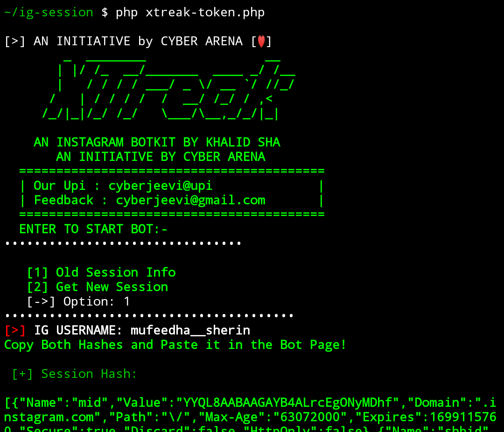

# ig-session
Instagram session(token) Generator (Made for use in xtreakbot.ml)

### How to?
Clone or Download the Git Repo

Unzip vendor dir inside ig-session
```
unzip vendor
```
Packages Required (Termux)
```
pkg install bzip2 (for Termux)
sudo apt install php-bz2 (for other linux)
```
Packages Required (Linux)
```
sudo apt install php-bz2
sudo apt install php-curl
sudo apt install php-mbstring
sudo apt install php-gd
sudo apt install php-gd2
```
[->] Also Enable All Above Extensions in '/etc/php/{VERSION}/cli/php.ini' file
(Screenshots will be given below)

Run Xtreak-Token.php
```
php xtreak-token.php
```


### About

Basically i made this tool for using inside our web based insta bot https://xtreakbot.ml . 
This tool simply login with your Credentials using Mgp25 Library and Save the session as a .dat file and let it print for you to Copy!!


### Screenshot


